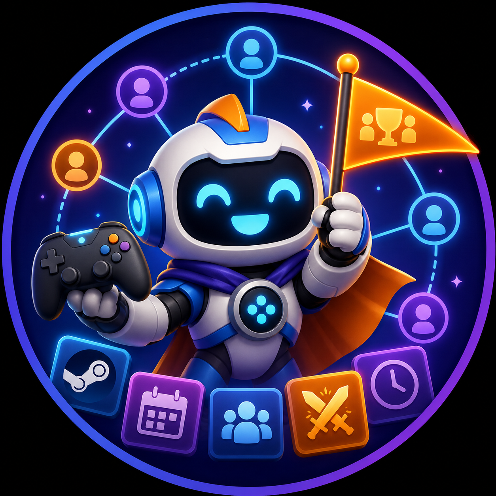

# GamePlan



GamePlan is a self-hosted, Discord-first planner for Steam game nights. It
helps a group find games they can play together, make a plan, and keep that
plan useful when real life changes it.

It runs on infrastructure you control. GamePlan has no connection to any
particular deployment or Discord server.

## What it does

- Links each player's Steam library through a private, one-time browser link.
- Helps a group pick a compatible game, decide together with a Game Vote, or
  start from a voice channel already in progress.
- Publishes confirmed Game Nights to a Discord **Session Feed**, with an
  attached discussion thread for RSVPs, changes, and conversation.
- Supports regular Game Nights, Games Tonight updates, late arrivals, early
  departures, multi-game plans, reminders, quiet hours, and personal mutes.
- Optionally integrates with a feedback service through generic OAuth and
  webhooks; it is entirely disabled unless an operator configures it.

## Start here

1. Read the [quick start](docs/quickstart.md) to run GamePlan locally or on a
   server.
2. Follow the [Discord application setup](docs/discord-setup.md), including
   the required permissions and Server Members Intent.
3. Read the [operations guide](docs/operations.md) before operating it for a
   group: public HTTPS, backups, updates, monitoring, and recovery matter.
4. In Discord, an administrator runs `/gameplan server` and chooses the
   Session Feed. Anyone can then use `/gameplan invite` to post a start card.

## Everyday commands

| Command | What it does |
| --- | --- |
| `/gameplan start` | Plan a Game Night: pick a game, decide together, or use a voice channel. |
| `/gameplan invite` | Post a getting-started card in the current channel. |
| `/gameplan server` | Choose the server's Session Feed (Manage Server or Administrator required). |
| `/gameplan me` and `/gameplan sync` | Link Steam, inspect private status, and sync the library. |
| `/gameplan group` and `/gameplan games` | Compare group ownership and manage game settings. |
| `/gameplan sessions`, `/gameplan regular`, `/gameplan tonight` | Follow upcoming, repeating, and in-progress Game Nights. |
| `/gameplan notifications` | Choose personal GamePlan notification preferences. |
| `/gameplan feedback` | Open an operator-configured feedback service, when enabled. |
| `/gameplan help` | Show the private Discord quick start. |

Steam profile and game details must be public for Steam to report ownership.
GamePlan never receives a Steam password.

## Development

```sh
npm ci
npm test
```

For configuration, migration, and production guidance, use the documents
linked above. See [migration policy](docs/migrations.md), [security and data
handling](docs/security-and-data.md), and [contributing](CONTRIBUTING.md).

## License

GamePlan, including the artwork in this repository, is available under the
[MIT License](LICENSE).
